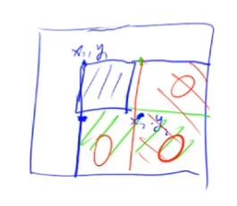

# 基础算法

排序、二分、高精度、前缀和与差分、双指针算法、位运算、离散化、区间合并。

---

#### 快速排序（思想：分治）

1. 确定分界点 x：可以是 nums[l]、nums[r]、nums[(l + r) / 2] 或者随机。

2. 调整区间：将数组划分为 <= x 和 >= x 两个部分，分界点不一定等于 x。

   当 nums[i] == x 时，其在左边和在右边都是可以的。

3. 递归处理左右两段。

注：快速排序是不稳定的排序，但可以通过加入第二个关键字（元素下标）的方式来变成稳定排序。

```java
public void quickSort(int[] nums, int l, int r) {
    if (l >= r) return;
    
    int i = l - 1, j = r + 1, x = nums[l + r >> 1];
    while (i < j) {
        do i++; while (nums[i] < x);
        do j--; while (nums[j] > x);
        if (i < j) {
            int tmp = nums[j];
            nums[j] = nums[i];
            nums[i] = tmp;
        }
    }
    
    quickSort(nums, l, j);
    quickSort(nums, j + 1, r);
}
```

#### 归并排序（思想：分治）

1. 确定分界点：mid = (l + r) / 2。
2. 递归排序左右两个部分。
3. 归并：将两个有序序列合并为一个有序序列。

```java
public void mergeSort(int[] nums, int l, int r) {
    if (l >= r) return;
    
    int mid = l + r >> 1;
    mergeSort(nums, l, mid);
    mergeSort(nums, mid + 1, r);
    
    int i = l, j = mid + 1, k = l;
    while (i <= mid && j <= r) {
        if (nums[i] <= nums[j]) tmp[k++] = nums[i++];
        else tmp[k++] = nums[j++];
    }
    
    while (i <= mid) tmp[k++] = nums[i++];
    while (j <= r) tmp[k++] = nums[j++];
    
    for (i = l; i <= r; i++) nums[i] = tmp[i];
}
```

#### 整数二分

每次缩小区间都保证答案在区间中，当区间长度为 1 时，区间中的元素就是所求答案。

- 二分的本质不是单调性：有单调性一定可以二分，但二分不一定需要单调性。

- 二分的本质是边界：只要能保证定义的某种性质，能够将区间一分为二，一半满足一半不满足（这两个区间没有交点），那么二分就可以寻找这个性质的边界，包括左区间的右边界和右区间的左边界。

  也就是说只要每次可以将区间长度缩小一半，就可以二分。

注：当 l = mid 时，需要 +1（mid = l + r + 1 >> 1）。

因为整除是向下取整，当 l = r - 1 时，如果不 +1 的话 mid = (l + r) / 2 = l，若此时 check(mid) 为 true，则 l 会更新为 l，这样就出现了死循环。

```java
public boolean check(int x) {} // 检查 x 是否满足某种性质

// 区间 [l, r] 被划分成 [l, mid] 和 [mid + 1, r] 时使用：
public int binarySearch1(int l, int r) {
    while (l < r) {
        int mid = l + r >> 1;
        if (check(mid)) r = mid; // check() 判断 mid 是否满足性质
        else l = mid + 1;
    }
    return l;
}

// 区间 [l, r] 被划分成 [l, mid - 1] 和 [mid, r] 时使用：
public int binarySearch2(int l, int r) {
    while (l < r) {
        int mid = l + r + 1 >> 1;
        if (check(mid)) l = mid;
        else r = mid - 1;
    }
    return l;
}
```

#### 浮点数二分

- 与整数二分相同，只不过没有整除，每次都可以将区间的长度严格的缩小一半，所以不用考虑边界情况。

- 每次缩小区间都保证答案在区间中，当区间长度很小时（r - l < eps），就可以认为我们找到了答案。

注：也可以直接二分 100 次，此时精度就已经很高了。

```java
public boolean check(int x) {} // 检查 x 是否满足某种性质

public double binarySearch3(double l, double r) {
    double eps = 1e-6; // eps 表示精度，经验值是题目要求 +2
    while (r - l > eps) {
        double mid = (l + r) / 2;
        if (check(mid)) r = mid;
        else l = mid;
    }
    return l;
}
```

#### 高精度加法

- 大整数存储：使用数组按低位到高位的顺序存储整数。

  如果按高位到低位存储进数组，当最高位产生进位时，就需要在最高位前添加进位，也就是在数组的最前面添加一个数，这样就需要向后移动整个数组中的元素。

- 模拟加法过程：A<sub>i</sub> + B<sub>i</sub> + carry。

```java
// C = A + B, A >= 0, B >= 0
public List<Integer> add(List<Integer> A, List<Integer> B) {
    if (B.size() > A.size()) return add(B, A);

    List<Integer> C = new ArrayList<>();
    int t = 0;
    for (int i = 0; i < A.size(); i++) {
        t += A.get(i);
        if (i < B.size()) t += B.get(i);
        C.add(t % 10);
        t /= 10;
    }

    if (t != 0) C.add(t);
    return C;
}
```

#### 高精度减法

- 大整数存储：使用数组按低位到高位的顺序存储整数。

  与加法相同，统一输入输出，方便同时计算加减乘除。

- 判断 A - B：

  - 如果 A >= B，则计算 A - B。
  - 如果 A < B，则计算 - (B - A)。

- 模拟减法过程：

  - 如果 A<sub>i</sub> - B<sub>i</sub> - borrow >= 0，则直接计算  A<sub>i</sub> - B<sub>i</sub> - borrow。

  - 如果 A<sub>i</sub> - B<sub>i</sub> - borrow < 0，则需要借位，计算  A<sub>i</sub> - B<sub>i</sub> - borrow + 10。

    因为我们计算的是大数减小数，所以肯定能借到位。

注：在计算 t = A<sub>i</sub> - B<sub>i</sub> - borrow 时，如果 t >= 0，则 t = t；如果 t < 0，则需要借位：t = t + 10。所以为了方便，直接计算 (t + 10) % 10。

```java
// C = A - B, 满足 A >= B, A >= 0, B >= 0
public List<Integer> sub(List<Integer> A, List<Integer> B) {
    List<Integer> C = new ArrayList<>();
    for (int i = 0, t = 0; i < A.size(); i++) {
        t = A.get(i) - t;
        if (i < B.size()) t -= B.get(i);
        C.add((t + 10) % 10);
        if (t >= 0) t = 0;
        else t = 1;
    }

    while (C.size() > 1 && C.get(C.size() - 1) == 0) C.remove(C.size() - 1);
    return C;
}
```

#### 高精度乘低精度

- 大整数存储：使用数组按低位到高位的顺序存储整数，小整数直接使用 int 存储。

  与加法相同，统一输入输出，方便同时计算加减乘除。

- 模拟乘法过程：A<sub>i</sub> * b + carry。

注：与我们人计算方式不同是，大整数每位是乘以整个小整数 b，而不是 b 中的一位。

```java
// C = A * b, A >= 0, b > 0
public List<Integer> mul(List<Integer> A, int b) {
    List<Integer> C = new ArrayList<>();
    int t = 0;
    for (int i = 0; i < A.size() || t != 0; i++) {
        if (i < A.size()) t += A.get(i) * b;
        C.add(t % 10);
        t /= 10;
    }

    return C;
}
```

#### 高精度除以低精度

- 大整数存储：使用数组按低位到高位的顺序存储整数，小整数直接使用 int 存储。

  与加法相同，统一输入输出，方便同时计算加减乘除。

- 模拟除法过程：remainder  * 10 + A<sub>i</sub>。

```java
// A / b = C ... r, A >= 0, b > 0
public int div(List<Integer> A, int b, List<Integer> C) {
    int t = 0;
    for (int i = A.size() - 1; i >= 0; i--) {
        t = t * 10 + A.get(i);
        C.add(t / b);
        t %= b;
    }

    Collections.reverse(C);
    while (C.size() > 1 && C.get(C.size() - 1) == 0) C.remove(C.size() - 1);
    return t; 
}
```

#### 一维前缀和

原序列为 a<sub>1</sub>，a<sub>2</sub>，a<sub>3</sub>, ..., a<sub>n</sub>，则前缀和 S<sub>i</sub> = a<sub>1</sub> + a<sub>2</sub> + a<sub>3</sub> + ... + a<sub>i</sub>。

- 如何求 S<sub>i</sub>：S[i] = S[i - 1] + a[i]。
- 作用：快速求解原序列中的一段和（O(1)），a[l] + ... + a[r] = S[r] - S[l - 1]。

注：定义边界：S<sub>0</sub> = 0，这样当求前缀和 a[1] + ... + a[r] 时也可以使用 S[r] - S[0]。

#### 二维前缀和

原二维矩阵为 a，二维前缀和为 S[i, j] 表示第 i 行 j 列格子左上部分所有元素的和。

- 如何求 S[i, j]：S[i, j] = S[i - 1, j] + S[i, j - 1] - S[i - 1, j - 1] + a[i, j]，其中 i，j 从 1 开始，方便计算。


- 作用：快速求以 (x<sub>1</sub>, y<sub>1</sub>) 为左上角，(x<sub>2</sub>, y<sub>2</sub>) 为右下角的子矩阵的和（O(1)），子矩阵和等于 S[x<sub>2</sub>, y<sub>2</sub>] - S[x<sub>1</sub> - 1, y<sub>2</sub>] - S[x<sub>2</sub>, y<sub>1</sub> - 1] + S[x<sub>1</sub> - 1, y<sub>1</sub> - 1]。

#### 一维差分

原序列为 a<sub>1</sub>，a<sub>2</sub>，a<sub>3</sub>, ..., a<sub>n</sub>，构造 b<sub>1</sub>，b<sub>2</sub>，b<sub>3</sub>, ..., b<sub>n</sub>，使得 a<sub>i</sub> = b<sub>1</sub> + b<sub>2</sub> + ... + b<sub>i</sub>，则 a 为 b 的前缀和，b 为 a 的差分。

- 差分只有一个操作，就是给原序列 a 中区间 [l, r] 上的每个数 + c。

  具体操作：

  - b[l] += c，使得 l 以及之后的所有点 a 都 + c
  - b[r + 1] -= c，使得 r 之后的所有点 a 再都 - c

  

这样求 b 的前缀和就可以得到原序列 a 中区间 [l, r] 上元素 a<sub>i</sub> + c 后的值。

- 如何求：假设原序列元素都为 0，这样构造的差分序列也都为 0，然后通过在这个假设序列的区间 [i, i] 上 + a<sub>i</sub> 来得到原序列元素 a<sub>i</sub>。
- 作用：差分适用于在原序列 a 上进行多次区间 + c 的操作，可以将每次操作的时间复杂度由 O(n) 变为 O(1)。

#### 二维差分

原矩阵为 a[i, j]，构造差分矩阵 b[i, j]，使得原矩阵是差分矩阵的前缀和。

- 差分只有一个操作，给以 (x<sub>1</sub>, y<sub>1</sub>) 为左上角，(x<sub>2</sub>, y<sub>2</sub>) 为右下角的子矩阵中的所有元素 + c。

  具体操作：

  - b[x<sub>1</sub>, y<sub>1</sub>] += c，使得 (x<sub>1</sub>, y<sub>1</sub>) 右下角所有点 a 都 + c
  - b[x<sub>2</sub> + 1, y<sub>1</sub>] -= c，使得 (x<sub>2</sub> + 1, y<sub>1</sub>) 右下角所有点 a 都 - c
  - b[x<sub>1</sub>, y<sub>2</sub> + 1] -= c，使得 (x<sub>1</sub>, y<sub>2</sub> + 1) 右下角所有点 a 都 - c
  - b[x<sub>2</sub> + 1, y<sub>2</sub> + 1] += c，加上重复减去的部分



- 如何求：同一维差分，不用考虑差分矩阵的构造。可以假设原矩阵元素都为 0，然后通过对假设的矩阵进行 n * m 次插入操作来变成初始值 a[i, j]。

#### 双指针算法

核心思想：利用某个性质（如单调性：随着 i 指针往后移动，j 指针是单调往后移动的）将原本暴力需要双重循环枚举两个指针的朴素算法（O(n <sup>2</sup>)）优化到只用枚举 n 个状态（O(n)）。

常见问题分类：

- 对于一个序列，用两个指针维护一段区间；
- 对于两个序列，维护某种次序，比如归并排序中合并两个有序序列的操作。

```java
for (int i = 0, j = 0; i < n; i++) {
    while (j < i && check(i, j)) j++;
    // 具体问题的逻辑
}
```

#### 位运算

- 求 n 的第 k 位数字（个位为第 0 位数字）：n >> k & 1。

  1. 先把第 k 位数字移到最后一位，n >> k。
  2. 再看个位是什么，x & 1。

- 返回 n 的最后一位 1（lowbit(0b1010) = 0b10）：lowbit(x) = x & -x。

  -x 为 x 的补码，即 x & -x = x & (~x + 1)。

#### 离散化

给定序列 a 的值域远远大于序列元素个数，并且要求以这些值为下标来操作时，我们不可能开一个值域大小的数组来记录序列 a，此时可以将 a<sub>1</sub>, a<sub>2</sub>, ..., a<sub>n</sub> 映射为 1, 2, ..., n，这样就只用开一个序列元素个数大小的数组就可以存储序列 a 了，这个过程就叫做离散化。

- 序列 a 中可能有重复元素：去重。

  distinct()：所有满足 i == 1 或者 a[i] != a[i - 1] 的数就是不重复的数。

- 如何算出 x 离散后的值：二分。

  保序离散化：将 a<sub>i</sub> 从小到大映射到下标。

```java
List<Integer> alls; // 存储所有待离散化的值
// 将所有值排序并去掉重复元素
alls = alls.stream().sorted().distinct().collect(Collectors.toList());

// 二分求出 x 对应的离散化的值
public int find(int x) { // 找到第一个大于等于 x 的位置
    int l = 0, r = alls.size() - 1;
    while (l < r) {
        int mid = l + r >> 1;
        if (alls[mid] >= x) r = mid;
        else l = mid + 1;
    }
    return r + 1; // 映射到 1, 2, ...n
}
```

#### 区间合并

若干个区间存在交集，合并有交集的区间（端点相交也合并），返回合并后区间的个数。

1. 按区间的左端点排序。

2. 扫描整个区间，将所有有交集的区间合并。

   维护当前区间 a 的 start 和 end，根据与后一个区间 b 的情况（a 包含 b、a 与 b 有交集、a 与 b 没有交集 ）更新 start 和 end。

```java
// 将所有存在交集的区间合并
public List<int[]> merge(List<int[]> segs) {
    List<int[]> ret = new ArrayList<>();
    
    segs.sort((o1, o2) -> o1[0] - o2[0]);
    
    int st = (int) -2e9, ed = (int) -2e9;
    for (int[] seg : segs) {
        if (ed < seg[0]) {
            if (st != -2e9) ret.add(new int[] {st, ed});
            st = seg[0];
            ed = seg[1];
        } else {
            ed = max(ed, seg[1]);
        }
    }
    
    if (st != -2e9) ret.add(new int[] {st, ed});
    
    return ret;
}
```

