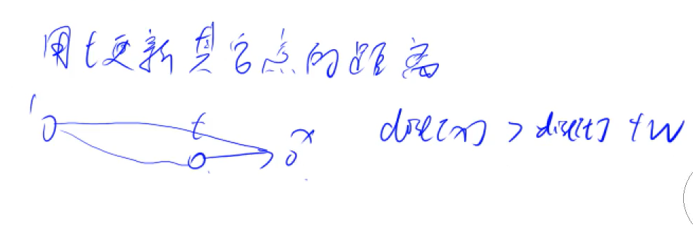
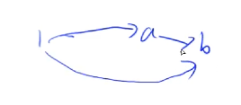
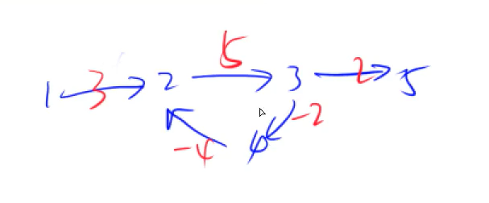

# 搜索与图论

DFS与BFS、树与图的遍历：拓扑排序、最短路、最小生成树、二分图：染色法、匈牙利算法。

---

### DFS 和 BFS

|     方法     |      dfs       |       bfs        |
| :----------: | :------------: | :--------------: |
| 使用数据结构 |       栈       |       队列       |
|     空间     |      O(h)      | O(2<sup>h</sup>) |
|     性质     | 具有最短路性质 | 不具有最短路性质 |

dfs：俗称暴搜，最重要的就是考虑搜索顺序，也就是用什么顺序可以将题目的所有方案不重不漏的全部遍历一遍，具体分析可以画出递归树来帮助理解。

bfs：具有最短路性质，如果每条边的权重都为 1，bfs 第一次搜索到的点，就是离源点最近的点。

注：

- dfs 和 bfs 的搜索过程中都不可以重复遍历节点，可以使用布尔数组标记遍历过的节点。

- 在 bfs 求最短路时，可以将距离数组中的值置为 -1 来标记对应节点未遍历过。

### 树和图的存储

树是一种特殊的图（无环连通图），与图的存储方式相同。而对于无向图中的边 a - b，我们可以存储两条有向边 a -> b、b -> a，因此我们只用考虑有向图的存储。

**邻接矩阵**

g[a]\[b] 存储边 a -> b，如果边有权重，就存储权重；如果边没有权重，就记一个布尔值，true 表示有边，false 表示没有。

不能存储重边，空间复杂度为 O(n<sup>2</sup>)，适合存储稠密图。

**邻接表**

对于每个点 k，开一个单链表，存储 k 所有可以走到的点，存储次序无所谓，适合存储稀疏图。

```java
// idx 表示边的序号，h[k] 存储这个单链表的头结点
int h[] = new int[N], e[] = new int[N], ne[] = new int[N], idx;

// 添加一条边 a -> b
public void add(int a, int b) {
    e[idx] = b;
    ne[idx] = h[a];
    h[a] = idx++;
}

// 初始化
idx = 0;
Arrays.fill(h, -1);
```

### 树与图的遍历

时间复杂度 O(n + m)，n 表示点数，m 表示边数。

**深度优先遍历** 

模板题 - [AcWing 846. 树的重心](java/practice/AcWing%20846.%20树的重心.md)

```java
public int dfs(int u) {
    st[u] = true; // st[u] 表示点 u 已经被遍历过

	for (int i = h[u]; i != -1; i = ne[i]) {
        int j = e[i];
        if (!st[j]) dfs(j);
    }
}
```

**宽度优先遍历**

模板题 - [AcWing 847. 图中点的层次](java/practice/AcWing%20847.%20图中点的层次.md)

```java
Queue<Integer> q = new ArrayDeque<>();
st[1] = true; // 表示 1 号点已经被遍历过
q.offer(1);

while (!q.isEmpty()) {
    int t = q.poll();

	for (int i = h[t]; i != -1; i = ne[i]) {
        int j = e[i];
        if (!st[j]) {
            st[j] = true; // 表示点 j 已经被遍历过
            q.offer(j);
        }
    }
}
```

### 拓扑排序

模板题 - [AcWing 848. 有向图的拓扑序列](java/practice/AcWing%20848.%20有向图的拓扑序列.md)

拓扑序列就是对于每条边起点都在终点前面，也就是说将一个图按拓扑序排好后，它所有的边都是从前指向后的。只有有向图才有拓扑序列，其中有向图无环图一定存在拓扑序列，被称为拓扑图。

入度：一个点有几条边进来；出度：一个点有几条边出去。

时间复杂度 O(n + m)，n 表示点数，m 表示边数。

```java
// 可以处理重边和自环的情况
public bool topsort() {
    int hh = 0, tt = -1;

    // d[i] 存储点 i 的入度
    for (int i = 1; i <= n; i++ ) {
        if (d[i] == 0) q[++tt] = i;
    }

    while (hh <= tt) {
        int t = q[hh++];

        for (int i = h[t]; i != -1; i = ne[i]) {
            int j = e[i];
            if (--d[j] == 0)
                q[++tt] = j;
        }
    }

    // 如果所有点都入队了，说明存在拓扑序列；否则不存在拓扑序列
    return tt == n - 1;
}
```

### 最短路

- 单源最短路：从一个点到其它所有点的最短距离。

  - 所有边权都为正数

    - 朴素 Dijkstra 算法：O(n<sup>2</sup>)，与边数无关，适合稠密图（m == n<sup>2</sup>）。

    - 堆优化版 Dijkstra 算法：O(m * logn)，适合稀疏图（m == n）。

  - 存在负权边

    - Bellman - Ford 算法：O(n * m)。

    - SPFA 算法：一般情况下 O(m)，最坏情况下 O(n * m)。

    一般情况下都是用 SPFA 算法，但当限制最短路的边数时，就只能使用 Bellman - Ford 算法。

- 多源汇最短路：任选两个点，从其中一个点走到另一个点的最短距离。

  - Floyd 算法：O(n<sup>3</sup>)。

其中源点表示起点，汇点表示终点，n 表示图中的点数，m 表示图中的边数。

注：

- 临接矩阵存储图时，重边之间会相互覆盖，所以需要去除重边，只保留权重最小的边；

- Floyd 算法需要去自环。

#### 朴素 Dijkstra 算法

模板题 - [AcWing 849. Dijkstra求最短路 I](java/practice/AcWing%20849.%20Dijkstra求最短路%20I.md)

1. 初始化距离：dist[1] = 0，dist[i] = 正无穷。

   因为第一步只遍历到起点，所以只有起点的距离是确定的。

2. 迭代 n 次，每次确定一个节点到起点的最短路。

   每次迭代寻找不在 s 中并且距离最小的点 t，这个距离就是点 t 到起点的最短路（基于贪心），将 t 放入 s 中，然后用 t 更新其它点的距离（dist[x] = min(dist[x], dist[t] + w)）。

其中距离是指当前点到起点的最短路距离， s 表示当前已确定最短路径距离的点的集合。



时间复杂度分析：

- 寻找不在 s 中并且距离最近的点 t 的操作时间复杂度是 O(n)，操作次数是 n。

- 使用节点 t 更新其它点的距离的操作次数是节点 t 的出边个数，所有点的出边之和是 m，所以总的更新操作的次数是 m，每次更新操作的时间复杂度为 O(1)。

所以总的时间复杂就是 O(n<sup>2</sup> + m)，n 表示点数，m 表示边数。

```java
int[][] g = new int[N][N]; // 稠密图，使用临界矩阵存储每条边
int[] dist = new int[N]; // 存储 1 号点到每个点的最短距离
boolean[] st = new boolean[N]; // 存储每个点的最短路是否已经确定

// 求 1 号点到 n 号点的最短路，如果不存在则返回 -1
public int dijkstra() {
    Arrays.fill(dist, 0x3f3f3f3f);
    dist[1] = 0;

    for (int i = 0; i < n - 1; i ++ ) {
        int t = -1;     // 在还未确定最短路的点中，寻找距离最小的点
        for (int j = 1; j <= n; j ++ ) {
            if (!st[j] && (t == -1 || dist[t] > dist[j])) t = j;
        }
        st[t] = true;

        // 用 t 更新其他点的距离
        for (int j = 1; j <= n; j ++ ) {
            dist[j] = Math.min(dist[j], dist[t] + g[t][j]);
        }
    }

    if (dist[n] == 0x3f3f3f3f) return -1;
    return dist[n];
}
```

#### 堆优化版 Dijkstra

模板题 - [AcWing 850. Dijkstra求最短路 II](java/practice/AcWing%20850.%20Dijkstra求最短路%20II.md)

- 朴素版 Dijkstra 寻找不在 s 中并且距离最近的点 t 的操作的时间复杂度是 O(n)，寻找的操作次数是 n，我们可以使用堆进行优化，将操作的时间复杂度降为 O(1)。

- 堆优化后每次更新距离操作的时间复杂度是 O(logn)，更新距离的操作次数是 m。

所以总的时间复杂度 O(n + m * logn)，n 表示点数，m 表示边数。

代码中的堆有两种实现方式：

- 手写堆：支持修改堆中任意元素，堆中最多存入 n 个元素，时间复杂度为 O(m * logn)。

- 优先队列：不支持修改堆中任意元素，所以需要存入冗余数据，也就是每次更新都会将更新距离后的点加入堆中，更新的操作次数是 m，所以堆中元素最多会有 m 个。

  时间复杂度是 m * logm，一般稀疏图 m <= n<sup>2</sup>，所以 logm < logn<sup>2</sup> = 2 * logn，所以也是 O(m * logn) 级别的。

注：

冗余的数据可以通过布尔数组 st 判断去掉：如果当前节点之前出队过，即 st[ver] = true，则跳过。

因为当一个节点第一次出队时它的距离就是最短距离，然后它会更新它的所有出边，之后它再从队列中弹出时，因为已经是最短距离了，所以它不会再更新其他节点的距离，可以直接跳过。

```java
int n; // 点的数量
int h[] = new int[N], e[] = new int[N], ne[] = new int[N], idx; // 稀疏图，使用邻接表存储所有边
int[] dist = new int[N]; // 存储所有点到 1 号点的距离
boolean[] st = new boolean[N]; // 存储每个点的最短距离是否已确定

// 求 1 号点到 n 号点的最短距离，如果不存在，则返回 -1
public int dijkstra() {
    Arrays.fill(dist, 0x3f3f3f3f);
    dist[1] = 0;
    
    PriorityQueue<int[]> heap = new PriorityQueue<>((o1, o2) -> o1[0] - o2[0]);
    heap.offer(new int[] {0, 1}); // arr[0]存储距离，arr[1]存储节点编号

    while (!heap.isEmpty()) {
        var t = heap.poll();
        int ver = t[1], distance = t[0];

        if (st[ver]) continue;
        st[ver] = true;

        for (int i = h[ver]; i != -1; i = ne[i]) {
            int j = e[i];
            if (dist[j] > distance + w[i]) {
                dist[j] = distance + w[i];
                heap.offer(new int[] {dist[j], j});
            }
        }
    }

    if (dist[n] == 0x3f3f3f3f) return -1;
    return dist[n];
}
```

#### Bellman - Ford算法

模板题 - [AcWing 853. 有边数限制的最短路](java/practice/AcWing%20853.%20有边数限制的最短路.md)

迭代 n 次，每次迭代遍历所有边（a -> b，边权为 w）来更新最短路（dist[b] = min(dist[b], dist[a] + w)）。

这个更新的过程称为松弛操作，时间复杂度为 O(n * m)，n 表示点数，m 表示边数。



注：

- 使用 Bellman - Ford 算法可以随意存边，只要能遍历所有边就行。一般定义一个类 Edge，有 m 条边的话就开一个大小为 m 的数组 Edge[m]。

- Bellman-Ford算法循环 n 次后，任意一条边 a -> b ，边权为 w，一定满足 dist[b] <= dist[a] + w，称为三角不等式。

- 有负权回路时，最短路不一定存在。

  - 如图所示，路径每进入负权环一次，路径大小 -1，这样可以在环中一直循环；也可能从起点到终点的路径不经过负权回路，所以就存在最短路。

  - 但当限制最短路边数时，负环就没有影响了，一定存在最短路。

  其中负权回路是指一圈的长度是小于 0 的回路。



- 只迭代 k 次时，最短距离数组 dist 有特殊含义：从 1 号点开始经过不超过 k 条边，走到每个节点的最短路距离。

  判负环：如果迭代到第 n 次又更新了某些边时，说明存在一条长度是 n 的最短路径，n 条边就意味着有 n + 1 个点，因为 1 ~ n 只有 n 个点，所以肯定有两个点的编号是一样的，也就是说路径上一定存在环，这个环一定是负环。

  backup 数组：在一次迭代中遍历每条边来更新距离时，可能会使用当前循环中刚刚更新完的值来进行更新，这样就发生了串联导致不满足限制了（最多经过 k 条边）。为此我们可以对 dist 数组进行备份，这样我们在更新时就只会使用上一次迭代的结果。

  一般情况下不需要使用 backup 数组，不影响结果的正确性，只有当有边数限制时才需要。

  

- bellman - ford 算法会用距离是正无穷的点来更新其他点， 因为存在负权边，所以当无解时 dist[n] 可能等于 0x3f3f3f3f 加上一个负权，所以使用 dist[n] > 0x3f3f3f3f / 2 来判断有没有最短路。其中距离为点到起点的距离。

  


```java
int n, m; // n 表示点数，m 表示边数
int[] dist = new int[N]; // dist[x] 存储 1 到 x 的最短路距离
Edge[] edges = new int[M]; // 边，a 表示出点，b 表示入点，w 表示边的权重

// 求 1 到 n 的最短路距离，如果无法从 1 走到 n，则返回 -1。
public int bellmanFord() {
    Arrays.fill(dist, 0x3f3f3f3f);
    dist[1] = 0;

    // 如果第 n 次迭代仍然会松弛三角不等式，就说明存在一条长度是 n + 1 的最短路径，由抽屉原理，路径中至少存在两个相同的点，说明图中存在负权回路。
    for (int i = 0; i < n; i++) {
        for (int j = 0; j < m; j++) {
            int a = edges[j].a, b = edges[j].b, w = edges[j].w;
            if (dist[b] > dist[a] + w) {
                dist[b] = dist[a] + w;
            }
        }
    }

    if (dist[n] > 0x3f3f3f3f / 2) return -1;
    return dist[n];
}

class Edge {
    int a, b, w;

    public Edge(int a, int b, int w) {
        this.a = a;
        this.b = b;
        this.w = w;
    }
}
```

#### spfa 算法（队列优化的 Bellman - Ford 算法）

模板题 - [AcWing 851. spfa求最短路](java/practice/AcWing%20851.%20spfa求最短路.md)

Bellman - Ford 算法每次迭代是遍历所有边（a -> b，边权为 w）来更新最短距离（dist[b] = min(dist[b], dist[a] + w)），但并不是每次遍历都能更新 dist[b]，只有当 dist[a] 变小了，作为 a 的出边 a -> b，dist[b] 才会更新，spfa就是从这里进行优化的，只要节点距离变小就放入队列，用它来更新它的所有出边。

时间复杂度平均情况下 O(m)，最坏情况下 O(n * m)，n 表示点数，m 表示边数。

与 bellman - ford 算法不同，spfa 算法从 1 号点 dist[1] = 0 开始更新其他点，是不会用距离是正无穷的点来更新其他点，所以使用 dist[n] == 0x3f3f3f3f 判断没有最短路。

注：只要图中没有负环就可以使用 spfa 算法，存在负环的话最短路会变成负无穷。

```java
int n; // 总点数
int h[] = new int[N], w[] = new int[N], e[] = new int[N], ne[] = new int[N], idx; // 邻接表存储所有边
int[] dist = new int[N];  // 存储每个点到 1 号点的最短距离
boolean[] st = new boolean[N]; // 存储每个点是否在队列中

// 求 1 号点到 n 号点的最短路距离，如果从 1 号点无法走到 n 号点则返回 -1
public int spfa() {
    Arrays.fill(dist, 0x3f3f3f3f);
    dist[1] = 0;

    Queue<Integer> q = new ArrayDeque<>();
    q.offer(1);
    st[1] = true;

    while (!q.isEmpty()) {
        var t = q.poll();
        st[t] = false;

        for (int i = h[t]; i != -1; i = ne[i]) {
            int j = e[i];
            if (dist[j] > dist[t] + w[i]) {
                dist[j] = dist[t] + w[i];
                if (!st[j]) { // 如果队列中已存在 j，则不需要将 j 重复插入
                    q.offer(j);
                    st[j] = true;
                }
            }
        }
    }

    if (dist[n] == 0x3f3f3f3f) return -1;
    return dist[n];
}
```

#### spfa判断图中是否存在负环

模板题 - [AcWing 852. spfa判断负环](java/practice/AcWing%20852.%20spfa判断负环.md)

原理同 Bellman - Ford算法相同，使用抽屉原理。

时间复杂度是 O(nm)，n 表示点数，m 表示边数。

注：

- 求负环时由于只需要判断负环是否存在，不需要求出路径具体长度的绝对值，因此 dist 数组就不需要初始化了。

- 因为从 1 开始的最短路可能到不了负环，所以初始时将所有点插入队列中，这样只要存在负环就一定可以找到。  

```java
int n; // 总点数
int h[] = new int[N], w[] = new int[N], e[] = new int[N], ne[] = new int[N], idx; // 邻接表存储所有边
int[] dist = new int[N], cnt = new int[N]; // dist[x]存储 1 号点到 x 的最短距离，cnt[x]存储 1 到 x 的最短路中经过的点数
boolean[] st = new int[N]; // 存储每个点是否在队列中

// 如果存在负环，则返回 true，否则返回 false。
public bool spfa() {
    // 不需要初始化 dist 数组
    // 原理：如果某条最短路径上有 n 个点（除了自己），那么加上自己之后一共有 n + 1 个点，由抽屉原理一定有两个点相同，说明图中存在负权回路。

    Queue<Integer> q = new ArrayDeque<>();
    // 判断从任意节点开始是否存在负环（可能存在从 1 节点开始到不了的负环）
    for (int i = 1; i <= n; i ++ ) {
        q.offer(i);
        st[i] = true;
    }

    while (q.size()) {
        auto t = q.front();
        q.pop();

        st[t] = false;

        for (int i = h[t]; i != -1; i = ne[i]) {
            int j = e[i];
            if (dist[j] > dist[t] + w[i]) {
                dist[j] = dist[t] + w[i];
                cnt[j] = cnt[t] + 1;
                // 如果从 1 号点到 x 的最短路中包含至少 n 个点（不包括自己），则说明存在环
                if (cnt[j] >= n) return true;       
                if (!st[j]) {
                    q.offer(j);
                    st[j] = true;
                }
            }
        }
    }

    return false;
}
```

#### floyd算法

**求最短路**

模板题 - [AcWing 854. Floyd求最短路](java/practice/AcWing%20854.%20Floyd求最短路.md)

基于动态规划，d[k]\[i]\[j] 表示从点 i 只经过点 1 到 k 到达点 j 的最短距离。

状态转移，d[k]\[i]\[j] = d[k -1]\[i]\[k] + d[k - 1]\[k]\[j]，也就是先从点 i 只经过点 1 到 k - 1 到达点 k，再从 k 只经过点 1 到 k - 1 到达点 j。

算法结束后，d[i]\[j] 存的就是 i 到 j 的最短路。时间复杂度是 O(n<sup>3</sup>)，n 表示点数。

当无解时，也就是 a 到 b 之间不存在通路时，由于负数边权的存在，到 b 的距离不一定是正无穷，可能比正无穷要小一些，所以判断无解的条件为 distance > 0x3f3f3f3f / 2。

注：可以处理负权边，但不能存在负环。

```java
// 初始化：临界矩阵存储图
for (int i = 1; i <= n; i++) {
    for (int j = 1; j <= n; j++) {
        // 去掉自环和重边
        if (i == j) d[i][j] = 0;
		else d[i][j] = INF;
    }
}

// 算法结束后，d[a][b] 表示 a 到 b 的最短距离
public void floyd() {
    for (int k = 1; k <= n; k ++ ) {
        for (int i = 1; i <= n; i ++ ) {
             for (int j = 1; j <= n; j ++ ) {
                 d[i][j] = Math.min(d[i][j], d[i][k] + d[k][j]);
             }
        }
    }
}
```

**传递闭包**

floyd 算法可以在 O(n<sup>3</sup>) 的时间复杂度内，求出任意两个点是否可以直接或者间接到达。

```java
boolean[][] d = new boolean[N][N]; // d[a][b] = true 代表 a 可以到达 b

for (int k = 0; k < n; k++) {
    for (int i = 0; i < n; i++) {
        for (int j = 0; j < n; j++) {
            if (d[i][k] && d[k][j]) d[i][j] = true;
        }
    }
}
```

### 最小生成树

- 普里姆算法（Prim）

  - 朴素版 Prim 算法：时间复杂度 O(n<sup>2</sup>)，稠密图。

  - 堆优化版 Prim 算法：时间复杂度 O(m * logn)，稀疏图，不常用。

- 克鲁斯卡尔算法（Kruskal）：时间复杂度 O(m * logm)，稀疏图。

注：可以解决的问题，无向图，边权正负都可以。

#### 朴素版 prim 算法

模板题 - [AcWing 858. Prim算法求最小生成树](java/practice/AcWing%20858.%20Prim算法求最小生成树.md)

同朴素版 Dijkstra 算法相似。

1. 将所有距离都初始化为正无穷。

2. 迭代 n 次，每次迭代寻找不在 s 中并且距离最近的点 t，用 t 来更新其它点的距离，然后把 t 加入集合 s 中。

3. 更新距离选择的边就是最小生成树中的边。

其中 s 表示当前最小生成树中点的集合；*距离* 表示该点到当前最小生成树的距离：这个点连接当前最小生成树的所有边当中长度最小的边的权重。

时间复杂度是 O(n<sup>2</sup> + m)，n 表示点数，m 表示边数。

注：最小生成树中不能包含自环，所以应该先累加再更新。

因为当一个点的自环边的权值是负数时，更新其它点的距离时也会将自己更新，所以如果先累加最小生成树的树边权重的话，会将自环边也加入到最小生成树中（最小生成树的定义是没有环的）。

```java
int n; // n 表示点数
int[][] g = new int[N][N];  // 邻接矩阵，存储所有边
int[] dist = new int[N]; // 存储其他点到当前最小生成树的距离
boolean[] st = new  boolean[N]; // 存储每个点是否已经在生成树中

// 如果图不连通，则返回 INF（值是 0x3f3f3f3f），否则返回最小生成树的树边权重之和
public int prim() {
    Arrays.fill(dist, 0x3f3f3f3f);

    int ret = 0;
    for (int i = 0; i < n; i ++ ) {
        int t = -1;
        for (int j = 1; j <= n; j ++ ) {
             if (!st[j] && (t == -1 || dist[t] > dist[j])) t = j;
        }

        if (i != 0 && dist[t] == INF) return INF;

        if (i != 0) ret += dist[t];
        st[t] = true;

        for (int j = 1; j <= n; j ++ ) dist[j] = Math.min(dist[j], g[j][t]);
    }

    return ret;
}
```

#### Kruskal 算法

模板题 - [AcWing 859. Kruskal算法求最小生成树](java/practice/AcWing%20859.%20Kruskal算法求最小生成树.md)

1. 将所有边按照权重从小到大排序，时间复杂度 O(m * logm)。
2. 枚举每条边 a - b，权重为 w，如果 a，b 不连通，就将这条边加入集合中（并查集的应用：find(a) == find(b)、union(a, b)，时间复杂度为 O(m)）。

时间复杂度是 O(m * logm)，n 表示点数，m 表示边数。

注：使用 Kruskal  算法不需要邻接表或者邻接矩阵来存储图，可以直接使用 Edge 对象数组来存储每条边的信息。

```java
int n, m;  // n是点数，m是边数
int[] p = new int[N]; // 并查集的父节点数组
Edge[] edges = new Edge[M]; // 存储边

public int find(int x) {  // 并查集核心操作
    if (p[x] != x) p[x] = find(p[x]);
    return p[x];
}

public int kruskal() {
    Arrays.sort(edges, 0, m, (o1, o2) -> o1.w - o2.w);

    for (int i = 1; i <= n; i ++ ) p[i] = i; // 初始化并查集

    int ret = 0, cnt = 0; // cnt 存储最小生成树中加入了多少边
    for (int i = 0; i < m; i ++ ) {
        int a = edges[i].a, b = edges[i].b, w = edges[i].w;

        a = find(a), b = find(b);
        if (a != b) { // 如果两个连通块不连通，则将这两个连通块合并
            p[a] = b;
            ret += w;
            cnt++;
        }
    }

    // 边数小于 n - 1 说明图是不连通的
    if (cnt < n - 1) return INF;
    return ret;
}

class Edge {
    int a, b, w;

    public Edge(int a, int b, int w) {
        this.a = a;
        this.b = b;
        this.w = w;
    }
}
```

### 二分图

如果能将一个图的节点集合分割成两个独立的子集 A 和 B，并使图中的每一条边的两个节点一个来自 A 集合，一个来自 B 集合，我们就将这个图称为二分图。

- 判断是否是二分图：染色法，时间复杂度 O(n + m)。

- 求二分图的最大匹配：匈牙利算法，时间复杂度 O(m * n)，实际运行时间一般远小于 O(m * n)。

#### 染色法判别二分图

模板题 - [AcWing 860. 染色法判定二分图](java/practice/AcWing%20860.%20染色法判定二分图.md)

当且仅当图中不含奇数环（环的边数时奇数）时，图为二分图。

从前往后遍历每个点，如果当前点未染色，就用 dfs 把该点所在的连通块全部染色。

- 只要一个图在染色法过程中出现了矛盾，就说明它是存在奇数环的，那么它就不是二分图。

- 只要染色法过程中没有出现矛盾，就说明这个图不存在奇数环，那么它就是一个二分图。

时间复杂度是 O(n + m)，n 表示点数，m 表示边数。

```java
int n; // n表示点数
int h[] = new int[N], e[] = new int[M], ne[] = new int[M], idx; // 邻接表存储图
int[] color = new int[N]; // 表示每个点的颜色，-1 表示未染色，0 表示白色，1 表示黑色

// 参数：u 表示当前节点，c 表示当前点的颜色
public bool dfs(int u, int c) {
    color[u] = c;
    for (int i = h[u]; i != -1; i = ne[i]) {
        int j = e[i];
        if (color[j] == -1) {
            if (!dfs(j, 1 - c)) return false;
        } else if (color[j] == c) return false;
    }

    return true;
}

public bool check() {
    Arrays.fill(color, -1);
    
    bool flag = true;
    for (int i = 1; i <= n; i ++ ) {
        if (color[i] == -1) {
            if (!dfs(i, 0)) {
                flag = false;
                break;
            }
        }
    }
        
    return flag;
}
```

#### 匈牙利算法（月老算法）

模板题 - [AcWing 861. 二分图的最大匹配](java/practice/AcWing%20861.%20二分图的最大匹配.md)

遍历子集 A 中的点，寻找与其匹配的另一个子集 B 中的点：

- 如果直接匹配成功：a1 - b2，则继续看子集 A 中的下一个点 a2；
- 如果与当前节点 a3 匹配的节点 b2 已经成功匹配过了，则看 b2 所匹配的点 a1，能否匹配子集 B 中的其它节点，这是一个递归的过程。
  - 如果可以皆大欢喜：a1 - b4；
  - 如果尝试所有可能都失败了，就放弃匹配 a1。

时间复杂度是 O(n * m)，n 表示点数，m 表示边数。


注：布尔数组 st 的作用是对于 n1 中的任意一点，保证只考虑 n2 中每个点一次。

因为如果当前 n1 中的节点 x 要匹配的 n2 中的节点 j 已经被匹配过了，我们会尝试让匹配 j 的节点 match[j] 换一个 n2 中的节点匹配，也就是 if (find(match[j]))，这时如果没有将 st[j] 标记上，那么在 match[j] 节点在进行 find 重新匹配的时候会再次考虑节点 j。

```java
int n1, n2; // n1表示第一个集合中的点数，n2表示第二个集合中的点数
int h[] = new int[N], e[] = new int[M], ne[] = new int[M], idx; // 邻接表存储所有边，匈牙利算法中只会用到从第一个集合指向第二个集合的边，所以这里只用存一个方向的边
int[] match = new int[N]; // 存储第二个集合中的每个点当前匹配的第一个集合中的点是哪个
boolean[] st = new int[N]; // 表示第二个集合中的每个点是否已经被遍历过

public bool find(int x) {
    for (int i = h[x]; i != -1; i = ne[i]) {
        int j = e[i];
        if (!st[j]) {
            st[j] = true;
            if (match[j] == 0 || find(match[j])) {
                match[j] = x;
                return true;
            }
        }
    }

    return false;
}

// 求最大匹配数，依次枚举第一个集合中的每个点能否匹配第二个集合中的点
int ret = 0;
for (int i = 1; i <= n1; i ++ ) {
    Arrays.fill(st, false);
    if (find(i)) ret++ ;
}
```